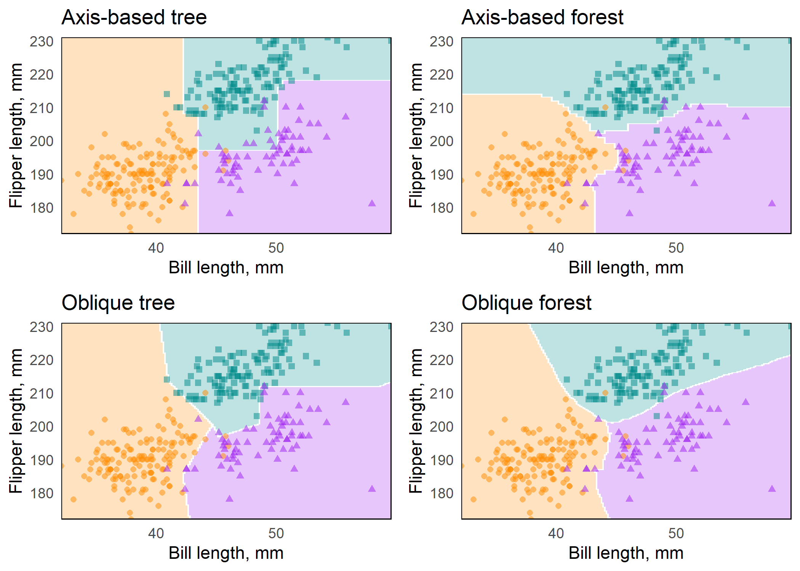

<!-- README.md is generated from README.Rmd. Please edit that file -->

# aorsf <a href="https://docs.ropensci.org/aorsf/"></a>

<!-- badges: start -->

[](https://www.repostatus.org/#active)
[](https://app.codecov.io/gh/bcjaeger/aorsf?branch=master)
[](https://github.com/ropensci/aorsf/actions/)
[](https://github.com/ropensci/software-review/issues/532/)
<a href="https://joss.theoj.org/papers/10.21105/joss.04705"></a>
[](https://CRAN.R-project.org/package=aorsf)
[](https://zenodo.org/doi/10.5281/zenodo.7116854)
<!-- badges: end -->

Fit, interpret, and make predictions with oblique random forests (RFs).

## Why aorsf?

- Fast and versatile tools for oblique RFs.<sup>1</sup>

- Accurate predictions.<sup>2</sup>

- Intuitive design with formula based interface.

- Extensive input checks and informative error messages.

- Compatible with `tidymodels` and `mlr3`

## Installation

You can install `aorsf` from CRAN using

``` r
install.packages("aorsf")
```

You can install the development version of aorsf from
[GitHub](https://github.com/) with:

``` r
# install.packages("remotes")
remotes::install_github("ropensci/aorsf")
```

## Get started

``` r
library(aorsf)
library(tidyverse)
```

`aorsf` fits several types of oblique RFs with the `orsf()` function,
including classification, regression, and survival RFs.

For classification, we fit an oblique RF to predict penguin species
using `penguin` data from the magnificent `palmerpenguins` [R
package](https://allisonhorst.github.io/palmerpenguins/)

``` r
# An oblique classification RF
penguin_fit <- orsf(data = penguins_orsf,
                    n_tree = 5, 
                    formula = species ~ .)

penguin_fit
#> ---------- Oblique random classification forest
#> 
#>      Linear combinations: Accelerated Logistic regression
#>           N observations: 333
#>                N classes: 3
#>                  N trees: 5
#>       N predictors total: 7
#>    N predictors per node: 3
#>  Average leaves per tree: 6.2
#> Min observations in leaf: 5
#>           OOB stat value: 0.99
#>            OOB stat type: AUC-ROC
#>      Variable importance: anova
#> 
#> -----------------------------------------
```

For regression, we use the same data but predict bill length of
penguins:

``` r
# An oblique regression RF
bill_fit <- orsf(data = penguins_orsf, 
                 n_tree = 5, 
                 formula = bill_length_mm ~ .)

bill_fit
#> ---------- Oblique random regression forest
#> 
#>      Linear combinations: Accelerated Linear regression
#>           N observations: 333
#>                  N trees: 5
#>       N predictors total: 7
#>    N predictors per node: 3
#>  Average leaves per tree: 50.4
#> Min observations in leaf: 5
#>           OOB stat value: 0.75
#>            OOB stat type: RSQ
#>      Variable importance: anova
#> 
#> -----------------------------------------
```

My personal favorite is the oblique survival RF with accelerated Cox
regression because it was the first type of oblique RF that `aorsf`
provided (see [JCGS
paper](https://doi.org/10.1080/10618600.2023.2231048)). Here, we use it
to predict mortality risk following diagnosis of primary biliary
cirrhosis:

``` r
# An oblique survival RF
pbc_fit <- orsf(data = pbc_orsf, 
                n_tree = 5,
                formula = Surv(time, status) ~ . - id)

pbc_fit
#> ---------- Oblique random survival forest
#> 
#>      Linear combinations: Accelerated Cox regression
#>           N observations: 276
#>                 N events: 111
#>                  N trees: 5
#>       N predictors total: 17
#>    N predictors per node: 5
#>  Average leaves per tree: 19.6
#> Min observations in leaf: 5
#>       Min events in leaf: 1
#>           OOB stat value: 0.75
#>            OOB stat type: Harrell's C-index
#>      Variable importance: anova
#> 
#> -----------------------------------------
```

## What does “oblique” mean?

Decision trees are grown by splitting a set of training data into
non-overlapping subsets, with the goal of having more similarity within
the new subsets than between them. When subsets are created with a
single predictor, the decision tree is *axis-based* because the subset
boundaries are perpendicular to the axis of the predictor. When linear
combinations (i.e., a weighted sum) of variables are used instead of a
single variable, the tree is *oblique* because the boundaries are
neither parallel nor perpendicular to the axis.

**Figure**: Decision trees for classification with axis-based splitting
(left) and oblique splitting (right). Cases are orange squares; controls
are purple circles. Both trees partition the predictor space defined by
variables X1 and X2, but the oblique splits do a better job of
separating the two classes.


So, how does this difference translate to real data, and how does it
impact random forests comprising hundreds of axis-based or oblique
trees? We will demonstrate this using the `penguin` data.<sup>3</sup> We
will also use this function to make several plots:

``` r
plot_decision_surface <- function(predictions, title, grid){
 
 # this is not a general function for plotting
 # decision surfaces. It just helps to minimize 
 # copying and pasting of code.
 
 class_preds <- bind_cols(grid, predictions) %>%
  pivot_longer(cols = c(Adelie,
                        Chinstrap,
                        Gentoo)) %>%
  group_by(flipper_length_mm, bill_length_mm) %>%
  arrange(desc(value)) %>%
  slice(1)
 
 cols <- c("darkorange", "purple", "cyan4")

 ggplot(class_preds, aes(bill_length_mm, flipper_length_mm)) +
  geom_contour_filled(aes(z = value, fill = name),
                      alpha = .25) +
  geom_point(data = penguins_orsf,
             aes(color = species, shape = species),
             alpha = 0.5) +
  scale_color_manual(values = cols) +
  scale_fill_manual(values = cols) +
  labs(x = "Bill length, mm",
       y = "Flipper length, mm") +
  theme_minimal() +
  scale_x_continuous(expand = c(0,0)) +
  scale_y_continuous(expand = c(0,0)) +
  theme(panel.grid = element_blank(),
        panel.border = element_rect(fill = NA),
        legend.position = '') + 
  labs(title = title)
 
}
```

We also use a grid of points for plotting decision surfaces:

``` r
grid <- expand_grid(

 flipper_length_mm = seq(min(penguins_orsf$flipper_length_mm),
                     max(penguins_orsf$flipper_length_mm),
                  len = 200),
 bill_length_mm = seq(min(penguins_orsf$bill_length_mm),
                      max(penguins_orsf$bill_length_mm),
                      len = 200)
)
```

We use `orsf` with `mtry=1` to fit axis-based trees:

``` r
fit_axis_tree <- penguins_orsf %>% 
 orsf(species ~ bill_length_mm + flipper_length_mm,
      n_tree = 1,
      mtry = 1,
      tree_seeds = 106760)
```

Next we use `orsf_update` to copy and modify the original model,
expanding it to fit an oblique tree by using `mtry=2` instead of
`mtry=1`, and to include 500 trees instead of 1:

``` r
fit_axis_forest <- fit_axis_tree %>% 
 orsf_update(n_tree = 500)

fit_oblique_tree <- fit_axis_tree %>% 
 orsf_update(mtry = 2)

fit_oblique_forest <- fit_oblique_tree %>% 
 orsf_update(n_tree = 500)
```

And now we have all we need to visualize decision surfaces using
predictions from these four fits:

``` r
preds <- list(fit_axis_tree,
              fit_axis_forest,
              fit_oblique_tree,
              fit_oblique_forest) %>% 
 map(predict, new_data = grid, pred_type = 'prob')

titles <- c("Axis-based tree",
            "Axis-based forest",
            "Oblique tree",
            "Oblique forest")

plots <- map2(preds, titles, plot_decision_surface, grid = grid)
```

**Figure**: Axis-based and oblique decision surfaces from a single tree
and an ensemble of 500 trees. Axis-based trees have boundaries
perpendicular to predictor axes, whereas oblique trees can have
boundaries that are neither parallel nor perpendicular to predictor
axes. Axis-based forests tend to have ‘step-function’ decision
boundaries, while oblique forests tend to have smooth decision
boundaries.



## Variable importance

The importance of individual predictor variables can be estimated in
three ways using `aorsf` and can be used on any type of oblique RF.
Also, variable importance functions always return a named character
vector

- **negation**<sup>2</sup>: Each variable is assessed separately by
  multiplying the variable’s coefficients by -1 and then determining how
  much the model’s performance changes. The worse the model’s
  performance after negating coefficients for a given variable, the more
  important the variable. This technique is promising b/c it does not
  require permutation and it emphasizes variables with larger
  coefficients in linear combinations, but it is also relatively new and
  hasn’t been studied as much as permutation importance. See
  Jaeger, (2023) for more details on this technique.

  ``` r
  orsf_vi_negate(pbc_fit)
  #>          bili        copper       protime       albumin       ascites 
  #>  0.1203848865  0.0592053045  0.0279486559  0.0237897777  0.0147007324 
  #>           trt           sex      alk.phos          trig       spiders 
  #>  0.0125080750  0.0116880832  0.0105730484  0.0044249987  0.0024722789 
  #>          chol         edema           age           ast      platelet 
  #>  0.0008840789  0.0004944292  0.0003003666 -0.0012533584 -0.0081733249 
  #>         stage        hepato 
  #> -0.0091305502 -0.0120281819
  ```

- **permutation**: Each variable is assessed separately by randomly
  permuting the variable’s values and then determining how much the
  model’s performance changes. The worse the model’s performance after
  permuting the values of a given variable, the more important the
  variable. This technique is flexible, intuitive, and frequently used.
  It also has several [known
  limitations](https://christophm.github.io/interpretable-ml-book/feature-importance.html#disadvantages-9)

  ``` r
  orsf_vi_permute(penguin_fit)
  #>    bill_length_mm       body_mass_g     bill_depth_mm flipper_length_mm 
  #>       0.210168971       0.079138442       0.061107587       0.050399635 
  #>            island              year               sex 
  #>       0.042829130       0.001689854      -0.003287019
  ```

- **analysis of variance (ANOVA)**<sup>4</sup>: A p-value is computed
  for each coefficient in each linear combination of variables in each
  decision tree. Importance for an individual predictor variable is the
  proportion of times a p-value for its coefficient is \< 0.01. This
  technique is very efficient computationally, but may not be as
  effective as permutation or negation in terms of selecting signal over
  noise variables. See [Menze,
  2011](https://link.springer.com/chapter/10.1007/978-3-642-23783-6_29)
  for more details on this technique.

  ``` r
  orsf_vi_anova(bill_fit)
  #>               sex           species            island flipper_length_mm 
  #>        0.37500000        0.33602187        0.09470954        0.05263158 
  #>     bill_depth_mm       body_mass_g              year 
  #>        0.05000000        0.04918033        0.00000000
  ```

You can supply your own R function to estimate out-of-bag error (see
[oob vignette](https://docs.ropensci.org/aorsf/articles/oobag.html)) or
to estimate out-of-bag variable importance (see [orsf_vi
examples](https://docs.ropensci.org/aorsf/reference/orsf_vi.html#examples))

## Partial dependence (PD)

Partial dependence (PD) shows the expected prediction from a model as a
function of a single predictor or multiple predictors. The expectation
is marginalized over the values of all other predictors, giving
something like a multivariable adjusted estimate of the model’s
prediction.. You can use specific values for a predictor to compute PD
or let `aorsf` pick reasonable values for you if you use
`pred_spec_auto()`:

``` r
# pick your own values
orsf_pd_oob(bill_fit, pred_spec = list(species = c("Adelie", "Gentoo")))
#>    species     mean      lwr     medn      upr
#>     <fctr>    <num>    <num>    <num>    <num>
#> 1:  Adelie 41.54048 35.51625 40.50000 49.89998
#> 2:  Gentoo 42.83185 36.01556 42.29556 51.04089

# let aorsf pick reasonable values for you:
orsf_pd_oob(bill_fit, pred_spec = pred_spec_auto(bill_depth_mm, island))
#>     bill_depth_mm    island     mean      lwr     medn      upr
#>             <num>    <fctr>    <num>    <num>    <num>    <num>
#>  1:          14.3    Biscoe 44.53325 37.12446 44.88000 51.00000
#>  2:          15.6    Biscoe 44.44897 37.08321 44.75000 51.03689
#>  3:          17.3    Biscoe 44.01986 36.14000 44.01250 53.43578
#>  4:          18.7    Biscoe 43.66173 35.99644 42.93095 54.32733
#>  5:          19.5    Biscoe 44.21056 35.96111 43.99167 54.45133
#> ---                                                            
#> 11:          14.3 Torgersen 42.92359 35.77868 42.54875 50.43488
#> 12:          15.6 Torgersen 42.82373 35.69733 42.54875 50.19559
#> 13:          17.3 Torgersen 42.93715 35.71257 42.40466 51.57472
#> 14:          18.7 Torgersen 42.46346 36.00470 41.13466 52.14050
#> 15:          19.5 Torgersen 42.88632 36.37587 41.55000 52.84875
```

The summary function, `orsf_summarize_uni()`, computes PD for as many
variables as you ask it to, using sensible values.

``` r
orsf_summarize_uni(pbc_fit, n_variables = 2)
#> 
#> -- bili (VI Rank: 1) -----------------------------
#> 
#>         |----------------- Risk -----------------|
#>   Value      Mean     Median     25th %    75th %
#>  <char>     <num>      <num>      <num>     <num>
#>    0.80 0.2039042 0.03907164 0.01204819 0.3547619
#>    1.40 0.2264253 0.06060606 0.01323529 0.4090909
#>    3.55 0.3281926 0.22379977 0.09090909 0.5000000
#> 
#> -- copper (VI Rank: 2) ---------------------------
#> 
#>         |----------------- Risk -----------------|
#>   Value      Mean     Median     25th %    75th %
#>  <char>     <num>      <num>      <num>     <num>
#>    42.5 0.2578622 0.05772203 0.01456808 0.4610507
#>    74.0 0.2774388 0.09090909 0.01666667 0.4945813
#>     130 0.3241708 0.19790500 0.02409639 0.5384615
#> 
#>  Predicted risk at time t = 1788 for top 2 predictors
```

For more on PD, see the
[vignette](https://docs.ropensci.org/aorsf/articles/pd.html)

## Individual conditional expectations (ICE)

Unlike partial dependence, which shows the expected prediction as a
function of one or multiple predictors, individual conditional
expectations (ICE) show the prediction for an individual observation as
a function of a predictor.

For more on ICE, see the
[vignette](https://docs.ropensci.org/aorsf/articles/pd.html#individual-conditional-expectations-ice)

## Interaction scores

The `orsf_vint()` function computes a score for each possible
interaction in a model based on PD using the method described in
Greenwell et al, 2018.<sup>5</sup> It can be slow for larger datasets,
but substantial speedups occur by making use of multi-threading and
restricting the search to a smaller set of predictors.

``` r
preds_interaction <- c("albumin", "protime", "bili", "spiders", "trt")

# While it is tempting to speed up `orsf_vint()` by growing a smaller 
# number of trees, results may become unstable with this shortcut.
pbc_interactions <- pbc_fit %>% 
 orsf_update(n_tree = 500, tree_seeds = 329) %>% 
 orsf_vint(n_thread = 0,  predictors = preds_interaction)

pbc_interactions
#>          interaction      score
#>               <char>      <num>
#>  1: albumin..protime 1.29270242
#>  2:    protime..bili 0.85645437
#>  3:    albumin..bili 0.68987446
#>  4:    bili..spiders 0.09060722
#>  5:        bili..trt 0.09060722
#>  6: protime..spiders 0.07798808
#>  7:     protime..trt 0.07798808
#>  8: albumin..spiders 0.05698401
#>  9:     albumin..trt 0.05698401
#> 10:     spiders..trt 0.00000000
```

What do the values in `score` mean? These values are the average of the
standard deviation of the standard deviation of PD in one variable
conditional on the other variable. They should be interpreted relative
to one another, i.e., a higher scoring interaction is more likely to
reflect a real interaction between two variables than a lower scoring
one.

Do these interaction scores make sense? Let’s test the top scoring and
lowest scoring interactions using `coxph()`.

``` r
library(survival)
# the top scoring interaction should get a lower p-value
anova(coxph(Surv(time, status) ~ protime * albumin, data = pbc_orsf))
#> Analysis of Deviance Table
#>  Cox model: response is Surv(time, status)
#> Terms added sequentially (first to last)
#> 
#>                  loglik  Chisq Df Pr(>|Chi|)    
#> NULL            -550.19                         
#> protime         -538.51 23.353  1  1.349e-06 ***
#> albumin         -514.89 47.255  1  6.234e-12 ***
#> protime:albumin -511.76  6.252  1    0.01241 *  
#> ---
#> Signif. codes:  0 '***' 0.001 '**' 0.01 '*' 0.05 '.' 0.1 ' ' 1
# the bottom scoring interaction should get a higher p-value
anova(coxph(Surv(time, status) ~ spiders * trt, data = pbc_orsf))
#> Analysis of Deviance Table
#>  Cox model: response is Surv(time, status)
#> Terms added sequentially (first to last)
#> 
#>              loglik   Chisq Df Pr(>|Chi|)    
#> NULL        -550.19                          
#> spiders     -538.58 23.2159  1  1.448e-06 ***
#> trt         -538.39  0.3877  1     0.5335    
#> spiders:trt -538.29  0.2066  1     0.6494    
#> ---
#> Signif. codes:  0 '***' 0.001 '**' 0.01 '*' 0.05 '.' 0.1 ' ' 1
```

Note: this is exploratory and not a true null hypothesis test. Why?
Because we used the same data both to generate and to test the null
hypothesis. We are not so much conducting statistical inference when we
test these interactions with `coxph` as we are demonstrating the
interaction scores that `orsf_vint()` provides are consistent with tests
from other models.

## Comparison to existing software

For survival analysis, comparisons between `aorsf` and existing software
are presented in our [JCGS
paper](https://doi.org/10.1080/10618600.2023.2231048). The paper:

- describes `aorsf` in detail with a summary of the procedures used in
  the tree fitting algorithm

- runs a general benchmark comparing `aorsf` with `obliqueRSF` and
  several other learners

- reports prediction accuracy and computational efficiency of all
  learners.

- runs a simulation study comparing variable importance techniques with
  oblique survival RFs, axis based survival RFs, and boosted trees.

- reports the probability that each variable importance technique will
  rank a relevant variable with higher importance than an irrelevant
  variable.

<!-- A more hands-on comparison of `aorsf` and other R packages is provided in [orsf examples](https://docs.ropensci.org/aorsf/reference/orsf.html#tidymodels) -->

## References

1.  Jaeger BC, Long DL, Long DM, Sims M, Szychowski JM, Min YI, Mcclure
    LA, Howard G, Simon N. Oblique random survival forests. *Annals of
    applied statistics*. 2019 Sep; 13(3):1847-83. DOI:
    10.1214/19-AOAS1261

2.  Jaeger BC, Welden S, Lenoir K, Speiser JL, Segar MW, Pandey A,
    Pajewski NM. Accelerated and interpretable oblique random survival
    forests. *Journal of Computational and Graphical Statistics*.
    Published online 08 Aug 2023. DOI: 10.1080/10618600.2023.2231048

3.  Horst AM, Hill AP, Gorman KB. palmerpenguins: Palmer Archipelago
    (Antarctica) penguin data. R package version 0.1.0. 2020. DOI:
    10.5281/zenodo.3960218

4.  Menze BH, Kelm BM, Splitthoff DN, Koethe U, Hamprecht FA. On oblique
    random forests. *Joint European Conference on Machine Learning and
    Knowledge Discovery in Databases*. 2011 Sep 4; pp. 453-469. DOI:
    10.1007/978-3-642-23783-6_29

5.  Greenwell BM, Boehmke BC, McCarthy AJ. A simple and effective
    model-based variable importance measure. *arXiv e-prints*. 2018 May
    12; arXiv:1805.04755. URL:
    <https://doi.org/10.48550/arXiv.1805.04755>

## Funding

The developers of `aorsf` received financial support from the Center for
Biomedical Informatics, Wake Forest University School of Medicine. We
also received support from the National Center for Advancing
Translational Sciences of the National Institutes of Health under Award
Number UL1TR001420.

The content is solely the responsibility of the authors and does not
necessarily represent the official views of the National Institutes of
Health.
